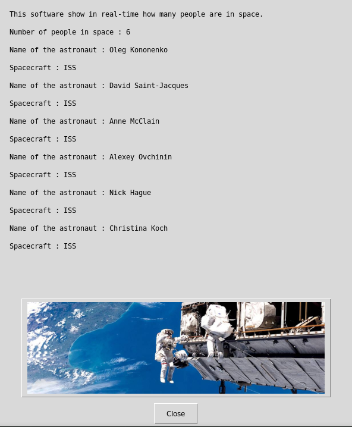

   

# Number of people in space



## What's this software ?  

This Python 3 software show in real-time how many people are in space.

Created with the api of http://open-notify.org/Open-Notify-API/People-In-Space/

## What you need to make it work :  


The last version of Python 3.

you also need to have the easygui library for python 3:

At least the version 0.98

```sh
sudo python3 -m pip install --upgrade easygui 
```

## How to launch this software :  

```sh
python3 PeopleSpace.py
```  

## Requirements :

If you miss a module, install it with the command pip install module-name. For example if you miss PIL you can install it with : sudo pip3 install pillow.
You must have read and write rights on the folder where you run this software.


## Developer - Author

Hamdy Abou El Anein

## Homepage

http://www.daylightlinux.ch 
